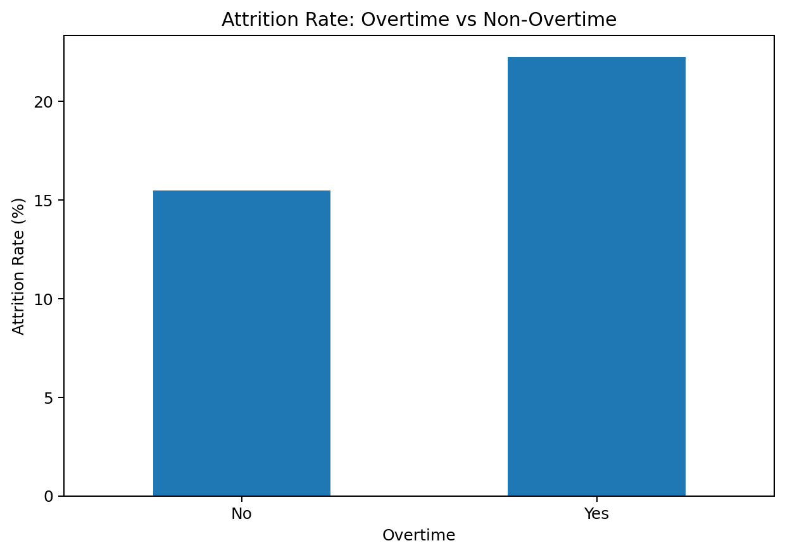
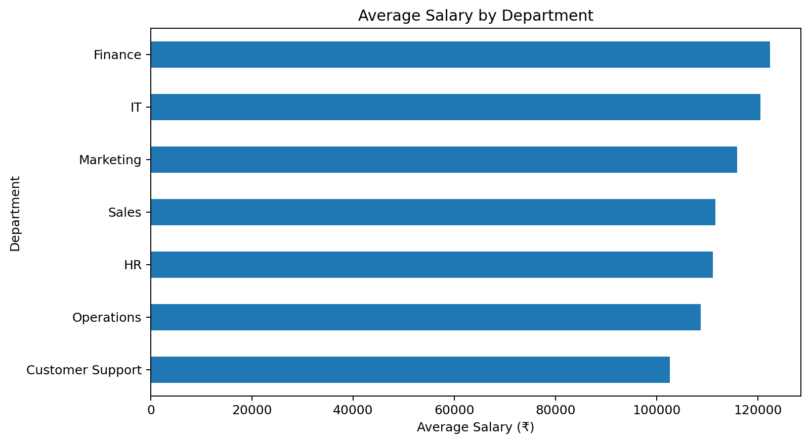
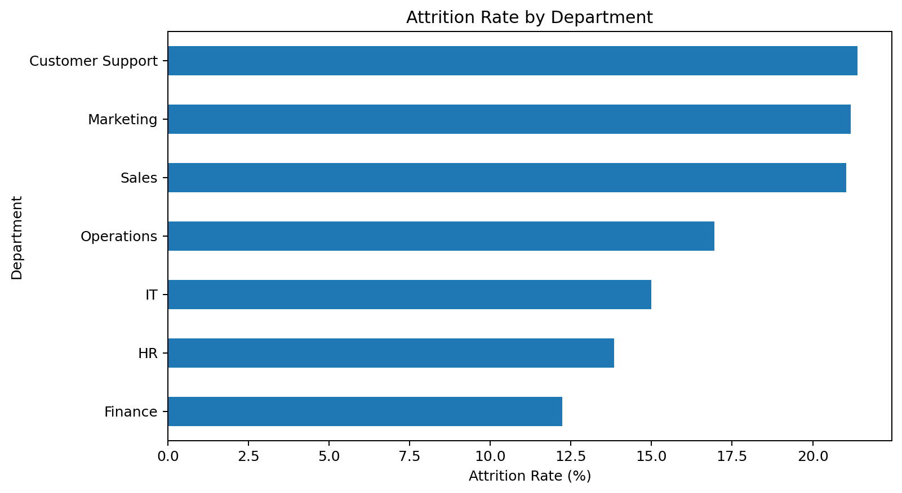
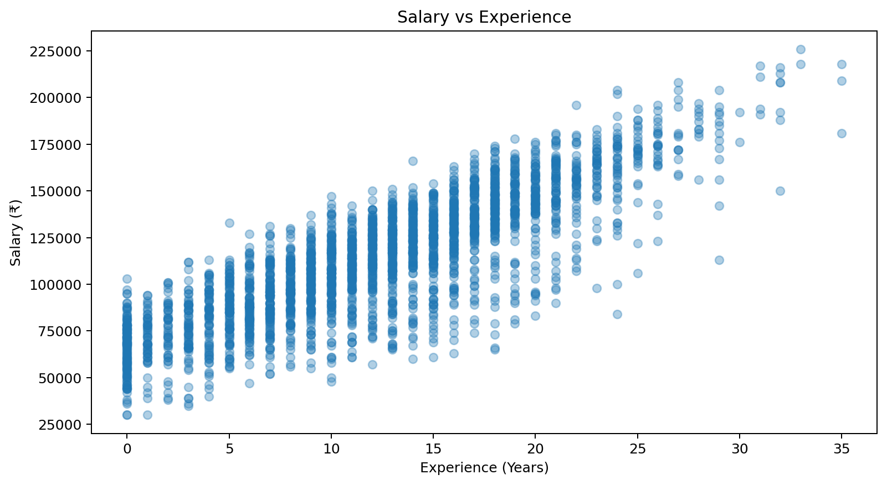
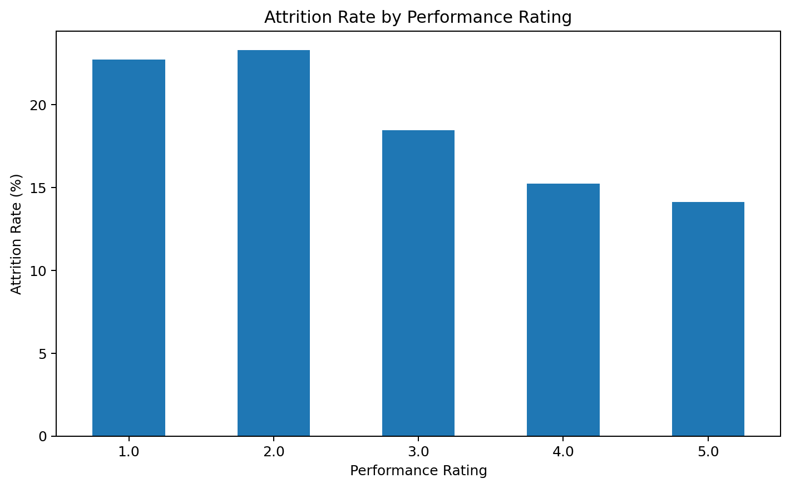

# HR Analytics with Python 📊

A portfolio-ready HR analytics project using Python, Pandas, NumPy, Matplotlib, and Seaborn on a synthetic dataset containing 2,500 unique employees and intentionally introduced data-quality issues.

## 🎯 Project Overview

This project demonstrates an end-to-end HR analytics workflow:

**Inspect → Clean → Validate → Analyze → Visualize → Interpret**

The analysis focuses on employee demographics, salary, experience, tenure, performance, satisfaction, workload, overtime, and attrition.

## 📊 Project Preview



## 📁 Dataset

- 2,505 raw rows
- 2,500 unique employees after duplicate removal
- 20 original columns
- 5 duplicate employee records intentionally included for cleaning practice
- Missing values intentionally included in selected fields

### Main fields

`Employee_ID`, `Age`, `Gender`, `Department`, `Job_Role`, `City`, `Education`, `Employment_Type`, `Experience_Years`, `Salary`, `Joining_Date`, `Tenure_Years`, `Performance_Rating`, `Job_Satisfaction`, `Overtime`, `Monthly_Work_Hours`, `Leave_Days`, `Absent_Days`, `Manager_ID`, `Attrition`

## 🧹 Data Cleaning

The project handles:

- Duplicate employee IDs
- Missing categorical values
- Missing numerical values using median imputation
- Numeric type conversion
- Date conversion
- Text standardization
- Derived HR analysis groups
- Attrition flag creation

## 📌 HR Analysis

### Overall KPIs

- Employee count
- Average and median salary
- Total salary expense
- Average age
- Average experience
- Average tenure
- Average job satisfaction
- Average monthly work hours
- Attrition rate

### Department Analysis

- Headcount
- Average salary
- Salary expense
- Performance
- Satisfaction
- Attrition

### Additional Analysis

- Job-role analysis
- Gender analysis
- Experience groups
- Performance ratings
- Overtime and workload
- Tenure groups

## 📈 Visualizations

The project generates five visualizations to explore salary, attrition, experience, performance, and overtime patterns.

### 1. Average Salary by Department



### 2. Attrition Rate by Department



### 3. Salary vs Experience



### 4. Attrition Rate by Performance Rating



### 5. Attrition Rate: Overtime vs Non-Overtime


## 💡 Business Insights

The analysis is designed to answer practical HR questions such as:

- Which departments have the highest salary levels?
- Which departments have the highest attrition?
- How does salary vary with experience?
- Is attrition different across performance levels?
- How does overtime relate to attrition?
- Which tenure groups show higher employee turnover?
- Which job roles combine high headcount with high attrition?

> Important: Correlation or group differences in this project should be interpreted as associations, not proof of causation.

## 🛠️ Technologies

- Python
- Pandas
- NumPy
- Matplotlib
- Seaborn

## 📂 Project Structure

```text
hr-analytics-python/
│
├── README.md
├── hr_analysis.py
├── hr_visualizations.py
├── hr_employee_data_2500.csv
├── hr_employee_data_cleaned.csv
├── requirements.txt
│
├── department_summary.csv
├── experience_summary.csv
├── gender_summary.csv
├── job_role_summary.csv
├── overtime_summary.csv
├── performance_summary.csv
├── tenure_summary.csv
│
└── screenshots/
    ├── salary_by_department.png
    ├── attrition_by_department.png
    ├── salary_vs_experience.png
    ├── performance_analysis.png
    └── attrition_overview.png

## ▶️ How to Run

### 1. Clone the repository

```bash
git clone https://github.com/shivakant-data/hr-analytics-python.git
cd hr-analytics-python
```

### 2. Install dependencies

```bash
pip install -r requirements.txt
```

### 3. Run the HR analysis

```bash
python hr_analysis.py
```

### 4. Generate visualizations

```bash
python hr_visualizations.py
```

